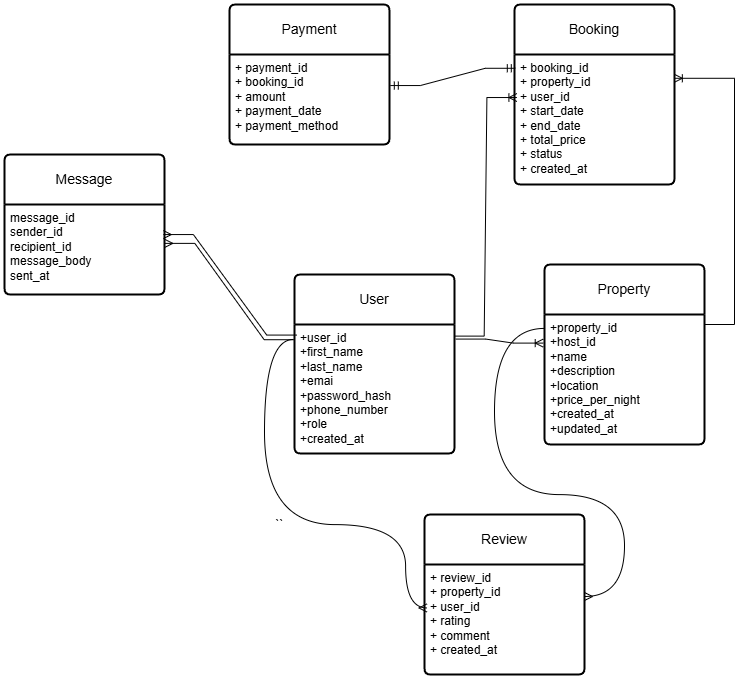

# Database Entity-Relationship Diagram (ERD)

## Objective
The objective of this ER diagram is to visually represent the relationships and structure of the database for an Airbnb-like application. The system manages users, properties, bookings, payments, messages, and reviews.

---

## Description of Entities and Relationships

### 1. **User**
- Attributes:
  - `user_id` (Primary Key)
  - `first_name`
  - `last_name`
  - `email`
  - `password_hash`
  - `phone_number`
  - `role` (e.g., Host or Guest)
  - `created_at` (Timestamp)

- Relationships:
  - A `User` can create multiple `Properties` (as a Host).
  - A `User` can make multiple `Bookings`.
  - A `User` can send and receive multiple `Messages`.
  - A `User` can leave multiple `Reviews`.

---

### 2. **Property**
- Attributes:
  - `property_id` (Primary Key)
  - `host_id` (Foreign Key referencing `User.user_id`)
  - `name`
  - `description`
  - `location`
  - `price_per_night`
  - `created_at`
  - `updated_at`

- Relationships:
  - Each `Property` is associated with one `Host` (a `User` with the `role` of "Host").
  - A `Property` can have multiple `Bookings`.
  - A `Property` can have multiple `Reviews`.

---

### 3. **Booking**
- Attributes:
  - `booking_id` (Primary Key)
  - `property_id` (Foreign Key referencing `Property.property_id`)
  - `user_id` (Foreign Key referencing `User.user_id`)
  - `start_date`
  - `end_date`
  - `total_price`
  - `status`
  - `created_at`

- Relationships:
  - A `Booking` is associated with one `User` (Guest).
  - A `Booking` is associated with one `Property`.
  - A `Booking` may have one corresponding `Payment`.

---

### 4. **Payment**
- Attributes:
  - `payment_id` (Primary Key)
  - `booking_id` (Foreign Key referencing `Booking.booking_id`)
  - `amount`
  - `payment_date`
  - `payment_method`

- Relationships:
  - Each `Payment` is linked to one `Booking`.

---

### 5. **Message**
- Attributes:
  - `message_id` (Primary Key)
  - `sender_id` (Foreign Key referencing `User.user_id`)
  - `recipient_id` (Foreign Key referencing `User.user_id`)
  - `message_body`
  - `sent_at`

- Relationships:
  - Each `Message` is associated with one sender (a `User`) and one recipient (a `User`).

---

### 6. **Review**
- Attributes:
  - `review_id` (Primary Key)
  - `property_id` (Foreign Key referencing `Property.property_id`)
  - `user_id` (Foreign Key referencing `User.user_id`)
  - `rating`
  - `comment`
  - `created_at`

- Relationships:
  - Each `Review` is associated with one `Property`.
  - Each `Review` is written by one `User`.

---

## ER Diagram

---

## Notes
- The diagram adheres to normalization principles, ensuring that data redundancy is minimized.
- All relationships are clearly defined with foreign key constraints.
- Timestamp fields (`created_at`, `updated_at`, etc.) track changes and additions to the database.

This ERD serves as the foundation for implementing the database schema in an RDBMS like MySQL or PostgreSQL.
