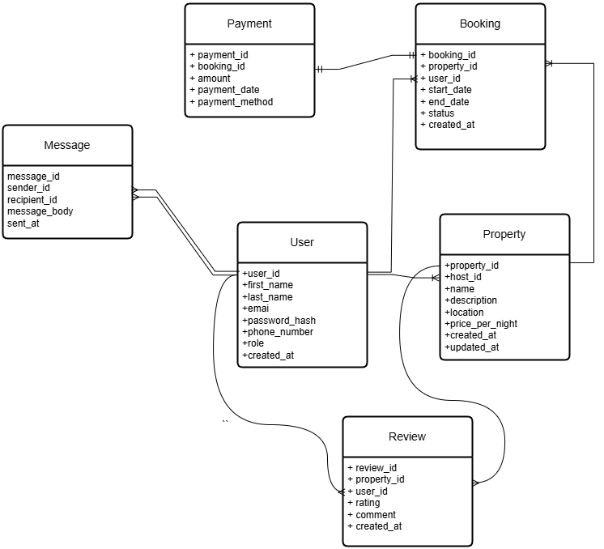

# Database Normalization to Third Normal Form (3NF)

## Objective
The goal of normalization is to eliminate redundancies and dependencies within the database design, ensuring data integrity and optimal storage efficiency. This document explains the steps taken to bring the database into the Third Normal Form (3NF).

---

## Issues Identified in the Original Design

### **Redundant Attribute: `total_price`**
- **Description**: The `total_price` attribute in the `Booking` table is redundant. It can be calculated dynamically as:

 `total_price` = (`end_date` - `start_date`) * `price_per_night` 
  - `end_date` and `start_date` are attributes of the `Booking` table.
  - `price_per_night` is an attribute of the `Property` table linked via `property_id`.

- **Violation**: Storing `total_price` violates normalization principles, as it introduces redundancy and the potential for inconsistency.

---

## Normalization Steps Applied

### Step 1: **Remove `total_price` from the `Booking` Table**
- **Reason**: `total_price` is a derived attribute and does not belong in the database schema. By removing it:
  - Data redundancy is eliminated.
  - The potential for discrepancies (e.g., incorrect `total_price` calculations) is reduced.

- **New Design**:
  - The `Booking` table now contains only essential attributes: `booking_id`, `property_id`, `user_id`, `start_date`, `end_date`, `status`, and `created_at`.

---

## Benefits of Normalization
1. **Eliminates Redundancy**: By removing `total_price`, the design ensures that each piece of information is stored only once.
2. **Improves Data Integrity**: Calculating `total_price` dynamically prevents inconsistencies in the event of updates to `price_per_night`, `start_date`, or `end_date`.
3. **Optimizes Storage**: Derived data is not stored, reducing storage overhead.

---

## Updated ER Diagram

---

## Conclusion
The database schema has been successfully normalized to 3NF. All data is now atomic, redundancies are eliminated, and every non-key attribute depends solely on the primary key. This ensures that the design is efficient, consistent, and adheres to best practices for relational database design.
